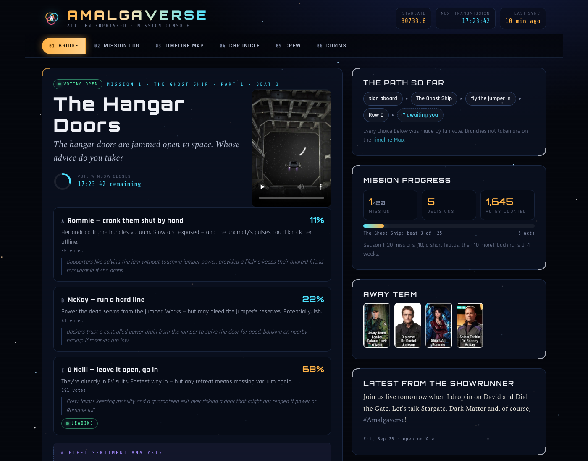

# Amalgaverse Console

**▶ Live site: https://codeshrew.github.io/amalgaverse/**

[](https://codeshrew.github.io/amalgaverse/)

A sci-fi mission console for following [Joseph Mallozzi](https://x.com/BaronDestructo)'s **#Amalgaverse**, a choose-your-own-adventure told in daily posts on X. Fans vote by replying, and the most popular reply decides what happens next.

```
npm start          # serve on http://localhost:4077 and refresh the data every 30 min
npm run update     # one-off data refresh (the AI reads the votes)
npm run update:fast  # one-off refresh, keyword vote counting only (no AI)
npm run serve      # serve only
```

You can also open `site/index.html` straight from disk. It will show the last snapshot, but it won't auto-refresh.

## Views

| Tab | What it shows |
|---|---|
| **Bridge** | The current decision with the live vote split, a countdown to when voting closes, a fleet-sentiment summary, the path taken so far, the away team, and the latest post from the showrunner |
| **Mission Log** | An episode guide. Each mission is broken into beats, and each beat opens to the full post, its media, the showrunner's "Previously on…" recap, and the final tally |
| **Timeline Map** | The branching path. The choice the story followed is lit up and the options not taken are dimmed |
| **Chronicle** | The whole story in order, with "the fleet decided…" cards between chapters |
| **Crew** | The 20-member crew manifest with portraits taken from the official manifest image. Shows who is on the away team, who has been lost, and ship assets |
| **Comms** | The showrunner's other #Amalgaverse posts: teasers, crew-selection votes, and "the vote is close!" updates |

## How the data is fetched (without the X API)

| Need | Source | Notes |
|---|---|---|
| Posts, media, stats, timeline | [FxTwitter API](https://github.com/FxEmbed/FxEmbed) `api.fxtwitter.com/i/status/<id>`, `/2/profile/<user>/statuses` | Free, no auth. Each beat quotes the one before it, so the updater follows that chain |
| Replies (the votes) | Nitter HTML (`nitter.click`, which pages through the replies) **plus** FxTwitter `/2/conversation/<id>` | Gets 85–100% of replies. On 2026-09-25, xcancel was suspended, most Nitter instances were behind bot walls, and X guest GraphQL needs an account |
| Paid fallback (optional) | Set `SOCIALDATA_API_KEY` or `TWITTERAPI_IO_KEY` | Only used if Nitter fails. About $0.15–0.20 per 1,000 replies, so a few cents a month |

To test the reply fetcher on its own: `npm run replies -- <postId>`.

## How votes are counted

1. Only **direct replies** to the post are counted, **one vote per account** (their latest reply), and the author's own replies are excluded.
2. Each reply is read against that beat's options by the first available classifier:
   - **[TypeSafe Jev](https://docs.typesafe.ai)** (`TYPESAFE_API_KEY`). For each reply it answers a Choice question (which option, or "none") with a calibrated confidence. Answers below 0.45 confidence count as *unclear* rather than being guessed. It also answers a Score question for **fleet morale**, which is how the fan feels about the story. Cost is about $0.04 per million input tokens, so pennies per month.
   - **Claude**, through the local `claude` CLI, or `ANTHROPIC_API_KEY` in CI.
   - **Keyword and row-letter matching** from `data/curation.json`.

   If both Jev and Claude have read the same replies, the site shows how often they agree.
3. Claude writes a short "fleet sentiment" summary of *why* people voted the way they did. Jev only classifies and doesn't generate text, so the summary still needs Claude. The site never shows individual replies. The raw replies stay in `.cache/`, which is gitignored.

Local secrets go in a gitignored `.env` file (`TYPESAFE_API_KEY=…`, `ANTHROPIC_API_KEY=…`), and the updater loads them automatically.

Mallozzi weighs people's reasoning, not just the numbers. So the "path taken" is the branch the **next post** actually followed, and it can differ from the top reply count.

## GitHub Pages

`.github/workflows/update.yml` runs the updater every 30 minutes, plus extra runs right after the 12:01 PM ET drop. It deploys `site/` to Pages.

- Reply text, vote labels and mirrored videos persist in the Actions cache and are never committed.
- Only `data/curation.json` changes are committed back to the repo.
- Secrets: `TYPESAFE_API_KEY`, optional `ANTHROPIC_API_KEY` (for the sentiment text), and optional `SOCIALDATA_API_KEY` / `TWITTERAPI_IO_KEY` if Nitter blocks GitHub's servers. `gh secret set -f .env` uploads your local `.env` in one go.

The published page also updates on its own between runs. FxTwitter allows direct requests from the browser, so the page checks it every few minutes for live reply, like and view counts. It also shows an **Incoming transmission** banner as soon as a new beat posts, before the next Action has run.

### Who does what

| Job | GitHub Actions (every 30 min) | Claude routine (cloud, 4× a day) |
|---|---|---|
| Fetch posts, replies and videos | ✓ | fetches reply samples only |
| Read votes and morale with Jev | ✓ | — |
| Work out which branch the story took (Jev reads the next post's opening) | ✓ | — |
| Catalogue a new beat's options | rule-based first pass (advocate names, contacts, rows, yes/no) | rewrites it properly |
| Write the sentiment readout text | — | ✓ |
| Publish | deploys Pages | pushes `data/`, which triggers a deploy |

The routine is a scheduled Claude Code cloud agent that runs on Anthropic's infrastructure, so nothing depends on your machine. It follows [`AGENT_TASKS.md`](AGENT_TASKS.md):
1. The routine's sandbox can only reach github.com. So each Actions run executes `agent-tasks.mjs prepare --local`, packs the task list and reply samples with AES-256-GCM, and force-pushes them to the `agent-packets` branch. The key is in the `AGENT_PACKET_KEY` secret and the routine's prompt. The repo is public, so reply text is never stored in the clear.
   The routine runs `git fetch origin agent-packets` and then `agent-tasks.mjs unpack`.
2. Claude writes the JSON answers.
3. `node scripts/agent-tasks.mjs apply` validates them and merges them into `data/`.
4. Claude commits and pushes.

Manage the routine at https://claude.ai/code/routines. Readouts the routine writes to `data/summaries.json` are authoritative, and Actions never overwrites them.

As a fallback, `scripts/local-sync.sh` does the same job from a Mac using your local `claude` login. `scripts/install-local-sync.sh` installs it as a launchd job. It's not installed by default.

## Curation

`data/curation.json` holds each beat's title, question and options. When a new beat appears, the updater catalogues it automatically using Claude. It extracts the options, keywords and away team, and works out which option the previous beat actually followed. Those entries are marked `"auto": true` and you can edit them freely. `data/crew.json` holds the crew manifest and ship assets. Set `"status": "lost"` on anyone the fleet gets killed.

## Layout

```
scripts/update.mjs      discovery → replies → tally → site/data/story.json (+ story.js)
scripts/lib/x.mjs       FxTwitter client
scripts/lib/replies.mjs Nitter + FxTwitter reply fetcher (+ optional paid APIs)
scripts/lib/votes.mjs   keyword + AI classifiers, per-voter dedupe, sentiment summary
scripts/lib/llm.mjs     headless `claude -p` wrapper with an on-disk cache
scripts/serve.mjs       zero-dependency static server (+ --watch)
site/                   the console (plain HTML/CSS/JS, no build)
```

This is a fan project. The story, characters and images belong to their creators. The site links back to every post, so go vote on X.
